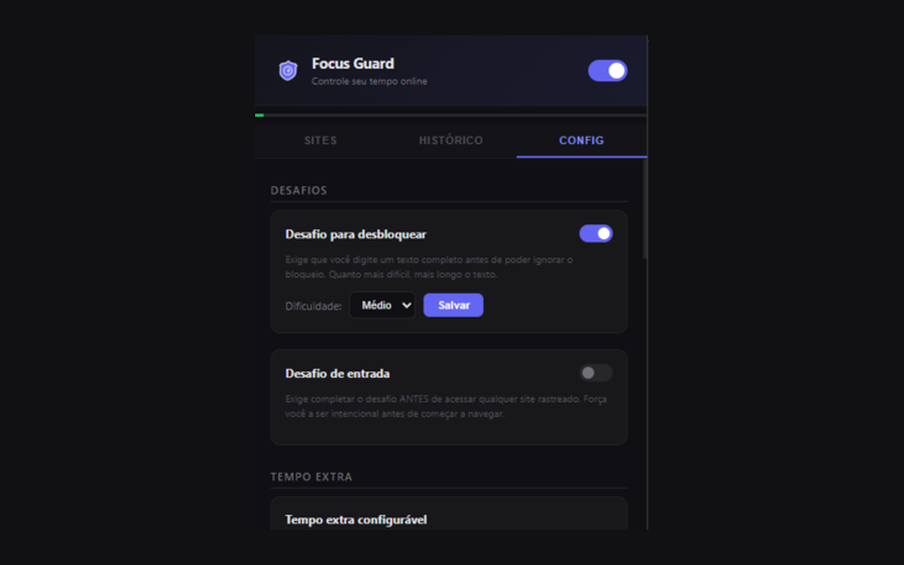
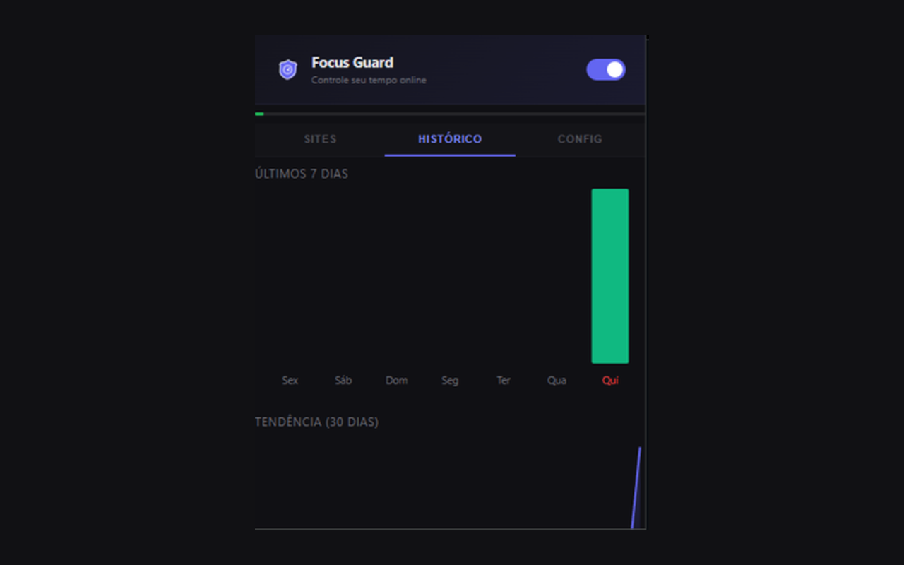
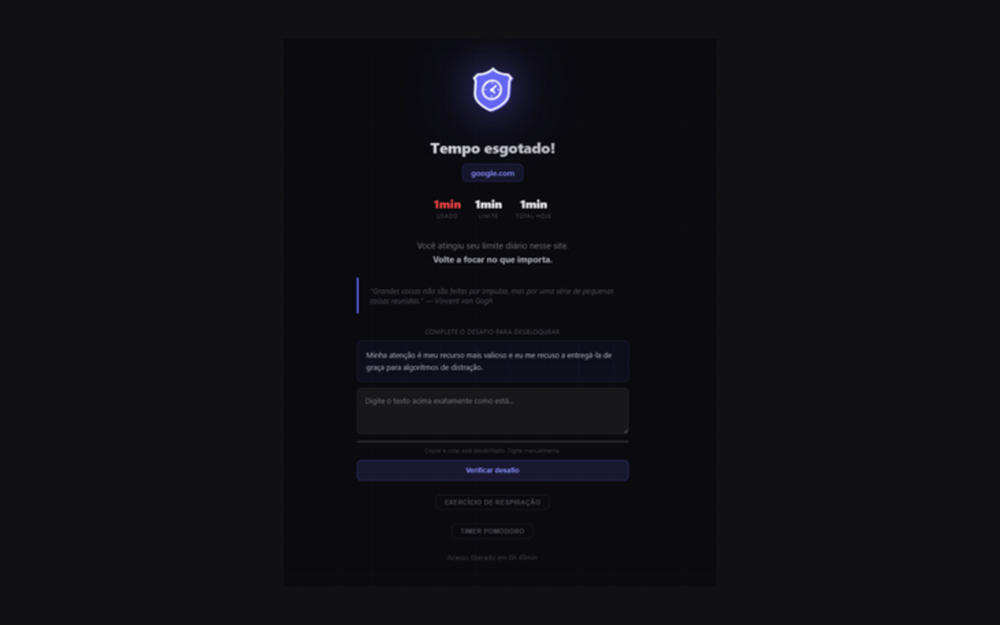
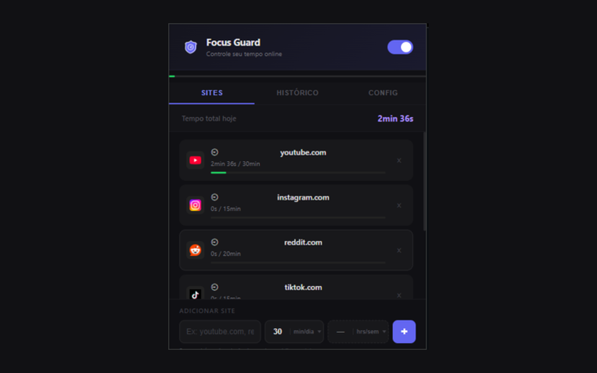

<p align="center">
  
</p>

<h1 align="center">Focus Guard</h1>

<p align="center">
  <strong>Retome o controle do seu tempo online.</strong><br>
  Extensao Chrome gratuita com limites diarios, modo foco, conquistas e historico de 365 dias.
</p>

<p align="center">
  <a href="https://chromewebstore.google.com/detail/focus-guard/ddcpdpjapbceoadjeeppaefbnepdmljp"></a>
  
  
  
</p>

---

## O que e

Focus Guard e uma extensao para Chrome que monitora quanto tempo voce gasta em sites que distraem e bloqueia o acesso quando o limite diario e atingido. Diferente de outras extensoes, **nenhum dado sai do seu navegador** — tudo fica salvo localmente.

## Screenshots

<p align="center">
  
  
</p>
<p align="center">
  
  
</p>

## Features

### Core
- **Limites diarios** — Defina minutos por dia para cada site (ex: 60min de YouTube)
- **Limites semanais** — Opcional, limita o total da semana
- **Bloqueio automatico** — Quando o limite acaba, o site e substituido por uma pagina de bloqueio
- **Badge em tempo real** — Icone da extensao mostra minutos restantes

### Modo Foco & Nuclear
- **Modo Foco** — Selecione sites especificos para bloquear por 15min a 8h
- **Nuclear Option** — Bloqueio total de TODOS os sites, impossivel de burlar
- **Pausar tracking** — Pause por 5-60min sem perder seu streak (max 3x/dia)

### Pagina de Bloqueio
- **Exercicio de respiracao** — Tecnica 4-4-4 com animacao de orbe
- **Timer Pomodoro** — 25min foco / 5min pausa integrado
- **Desafio de digitacao** — Copie um texto para desbloquear (anti-impulso)
- **Bypass controlado** — +5 minutos extras com limite diario de 1h
- **Frases motivacionais** — Aleatorias a cada bloqueio

### Progresso & Gamificacao
- **12 conquistas** — Badges desbloqueados por marcos (streaks, desafios, foco)
- **Streak de dias** — Rastreamento de dias consecutivos sem estourar limites
- **Metas semanais** — Objetivos motivacionais (nao bloqueiam)
- **Historico de 365 dias** — Contribution graph estilo GitHub

### Filtro de YouTube
- **Ocultar Shorts** — Remove a secao de Shorts da home, sidebar e resultados de busca do YouTube
- **Redirecionar Shorts** — Se voce acessar um link `/shorts/`, redireciona automaticamente para o player normal (`/watch?v=`)
- **Ocultar comentarios** — Esconde a secao de comentarios em videos e Shorts
- **Deteccao em 3 camadas** — Seletores primarios, fallback por atributos, e heuristicos por aria-label
- **Toggle individual** — Ative/desative Shorts e comentarios separadamente no Settings

### Polish
- **Tema claro/escuro/sistema** — Com CSS custom properties
- **Notificacoes inteligentes** — Alertas em 50%, 75%, 90% do limite
- **Onboarding guiado** — Wizard de 3 passos no primeiro uso
- **Animacoes suaves** — Com respeito a `prefers-reduced-motion`

## Instalacao

### Chrome Web Store (recomendado)
1. Acesse a [pagina da extensao](https://chromewebstore.google.com/detail/focus-guard/ddcpdpjapbceoadjeeppaefbnepdmljp) na Chrome Web Store
2. Clique em **"Usar no Chrome"**
3. Pronto!

### Instalacao manual (sem Chrome Web Store)

Se voce prefere nao usar a Chrome Web Store, pode instalar diretamente:

#### Opcao A: Download do ZIP (mais facil)
1. Acesse o [repositorio no GitHub](https://github.com/GabrielBBaldez/focus-guard)
2. Clique no botao verde **"Code"** → **"Download ZIP"**
3. Extraia o ZIP em uma pasta no seu computador (ex: `C:\focus-guard` ou `~/focus-guard`)
4. Abra o Chrome e digite `chrome://extensions` na barra de endereco
5. Ative o **Modo do desenvolvedor** (toggle no canto superior direito)
6. Clique em **"Carregar sem compactacao"** (ou "Load unpacked" em ingles)
7. Selecione a pasta onde voce extraiu os arquivos
8. Pronto! O icone do Focus Guard aparece na barra do Chrome

#### Opcao B: Git clone (para devs)
```bash
git clone https://github.com/GabrielBBaldez/focus-guard.git
```
1. Abra `chrome://extensions` no Chrome
2. Ative **Modo do desenvolvedor** (toggle no canto superior direito)
3. Clique em **"Carregar sem compactacao"**
4. Selecione a pasta `focus-guard`

#### Funciona em outros navegadores Chromium
A instalacao manual funciona da mesma forma em:
- **Microsoft Edge** → `edge://extensions`
- **Brave** → `brave://extensions`
- **Opera** → `opera://extensions`
- **Vivaldi** → `vivaldi://extensions`

> **Nota:** Ao instalar manualmente, o Chrome pode mostrar um aviso sobre "extensoes em modo desenvolvedor" ao iniciar. Isso e normal e nao afeta o funcionamento.

## Como usar

1. **Clique no icone** do Focus Guard na barra do Chrome
2. **Adicione um site** — Digite o dominio (ex: `youtube.com`) e defina o limite em minutos
3. **Navegue normalmente** — O Focus Guard monitora automaticamente em segundo plano
4. **Quando o limite acabar** — O site e substituido pela pagina de bloqueio
5. **Acompanhe seu progresso** — Veja historico, conquistas e streaks no popup

### Dicas
- Use o **Modo Foco** para sessoes de estudo/trabalho (mais acessivel que Nuclear)
- Ative **Nuclear** em emergencias — impossivel desativar ate o tempo acabar
- **Pause** quando precisar de uma pausa legitima sem quebrar o streak
- Veja o **contribution graph** no History para visualizar seus padroes

## Arquitetura

```
focus-guard/
├── manifest.json          # Manifest V3 config
├── background.js          # Service worker (tracking, alarms, storage)
├── popup.html/js          # Interface principal da extensao
├── blocked.html/js        # Pagina exibida ao bloquear um site
├── defaults.js            # Constantes compartilhadas (single source of truth)
├── youtube-filter.js      # Content script para filtrar YouTube
├── landing/               # Landing page do projeto
│   └── index.html
├── icons/
│   ├── logo.png           # Logo principal (512x512)
│   ├── icon16.png
│   ├── icon48.png
│   └── icon128.png
└── PRIVACY.md             # Politica de privacidade
```

### Stack
- **Chrome Extension Manifest V3**
- **Vanilla JS** — Zero dependencias, zero build step
- **CSS Custom Properties** — Temas via variaveis CSS
- **chrome.storage.local** — Persistencia 100% local
- **chrome.alarms** — Timers para nuclear, pausa, snapshots
- **chrome.notifications** — Alertas nativos do OS

## Privacidade

**Zero dados coletados. Zero servidores. Zero rastreamento.**

- Todos os dados ficam em `chrome.storage.local` no seu navegador
- Nenhuma requisicao HTTP e feita pela extensao
- Nenhum analytics, telemetria ou tracking de qualquer tipo
- Se voce desinstalar, todos os dados sao apagados automaticamente

Leia a [politica completa](PRIVACY.md).

## Permissoes

| Permissao | Motivo |
|-----------|--------|
| `storage` | Salvar limites, historico e configuracoes localmente |
| `tabs` | Detectar qual site esta ativo para contar o tempo |
| `alarms` | Timers para nuclear, pausa e snapshots periodicos |
| `webNavigation` | Detectar navegacao para bloquear sites no momento certo |
| `notifications` | Alertas quando limites estao perto de acabar |

## Contribuindo

1. Fork o repositorio
2. Crie uma branch (`git checkout -b feature/minha-feature`)
3. Commit suas mudancas (`git commit -m 'feat: minha feature'`)
4. Push para a branch (`git push origin feature/minha-feature`)
5. Abra um Pull Request

## Licenca

MIT License — use, modifique e distribua livremente.

---

<p align="center">
  Feito com foco por <a href="https://github.com/GabrielBBaldez">@GabrielBBaldez</a>
</p>
